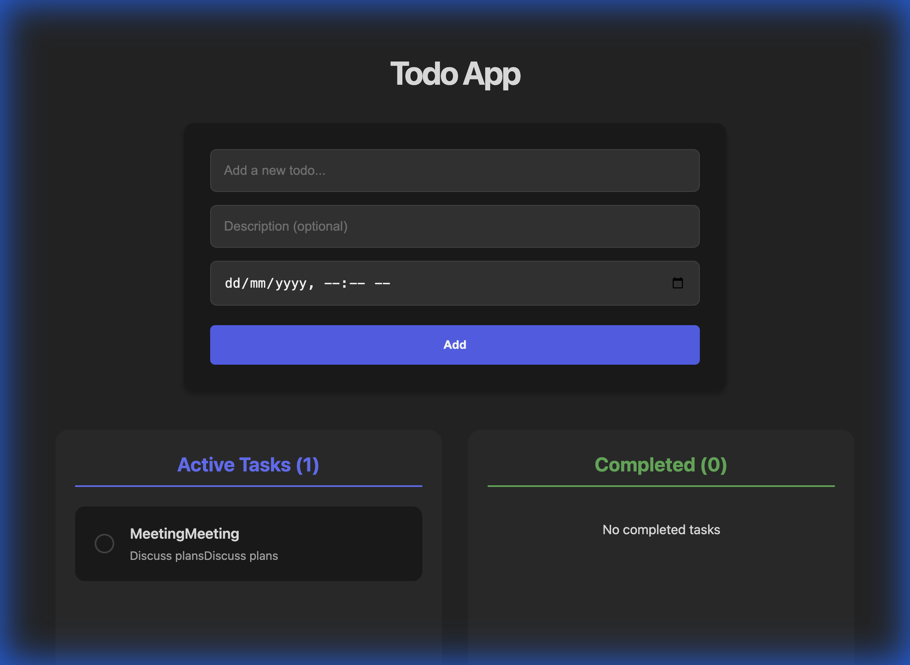
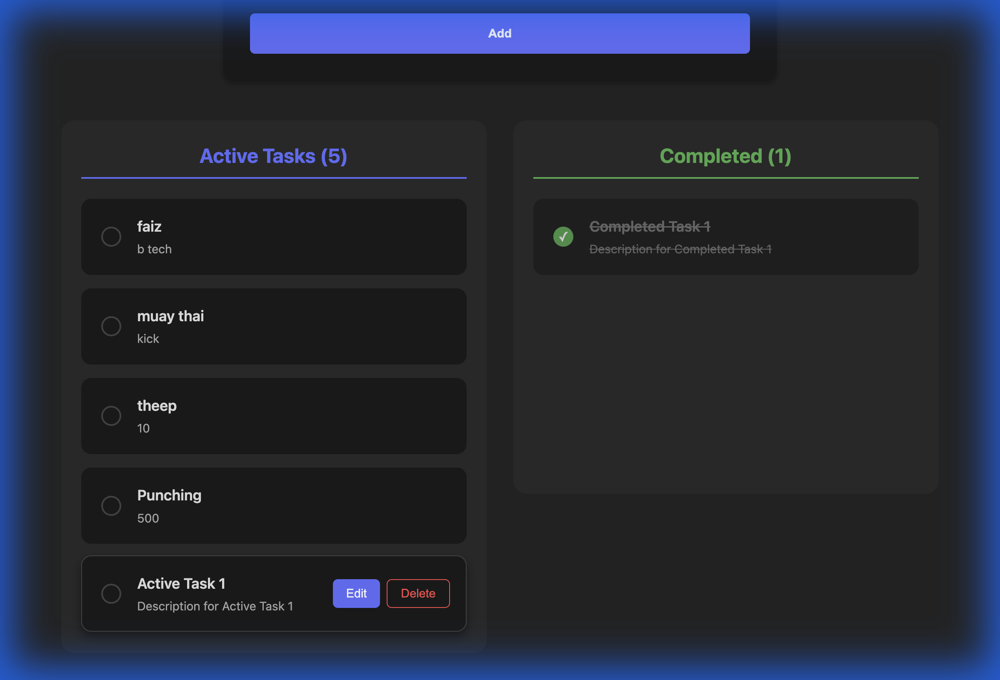
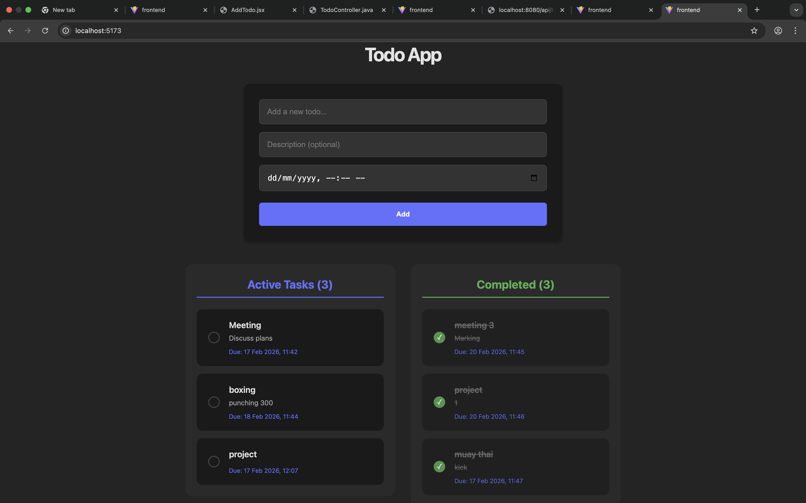

# Full-Stack Todo Application

A robust and modern Todo application built with **Spring Boot** (Backend) and **React** (Frontend).

## 🚀 Features

- **Dashboard Layout**: Organize tasks into "Active" and "Completed" columns.
- **Task Management**: Create, Read, Update, and Delete (CRUD) todos.
- **Due Dates**: Schedule tasks with specific dates and times.
- **Responsive Design**: precise styling for a clean user experience.
- **In-Memory Database**: Uses H2 for quick setup and testing.

## 🛠️ Tech Stack

### Backend
- **Java 21**
- **Spring Boot 3.x**
- **Spring Data JPA**
- **H2 Database**
- **Maven** (Wrapper included)

### Frontend
- **React 18**
- **Vite**
- **Axios**
- **CSS3** (Custom properties & Flexbox/Grid)

## 📋 Prerequisites

- Java 21 SDK
- Node.js (v18 or higher)
- Maven (optional, wrapper provided)

## ⚙️ Installation & Running

### 1. Backend Setup

Navigate to the backend directory and run the Spring Boot application:

```bash
cd backend
./mvnw spring-boot:run
```

The backend server will start at `http://localhost:8080`.
- **H2 Console**: [http://localhost:8080/h2-console](http://localhost:8080/h2-console)
  - JDBC URL: `jdbc:h2:mem:testdb`
  - User: `sa`
  - Password: `password`

### 2. Frontend Setup

Open a new terminal, navigate to the frontend directory, install dependencies, and start the dev server:

```bash
cd frontend
npm install
npm run dev
```

The frontend application will run at `http://localhost:5173`.

## 🔌 API Endpoints

| Method | Endpoint | Description |
| :--- | :--- | :--- |
| `GET` | `/api/todos` | Fetch all todos |
| `POST` | `/api/todos` | Create a new todo |
| `PUT` | `/api/todos/{id}` | Update an existing todo |
| `DELETE` | `/api/todos/{id}` | Delete a todo |

## 📸 Screenshots

### Dashboard & Task Management


### Adding a Task with Due Date


### Backend Structure


### Frontend Structure


### Database


## 📄 License

This project is open-source and available under the [MIT License](LICENSE).
